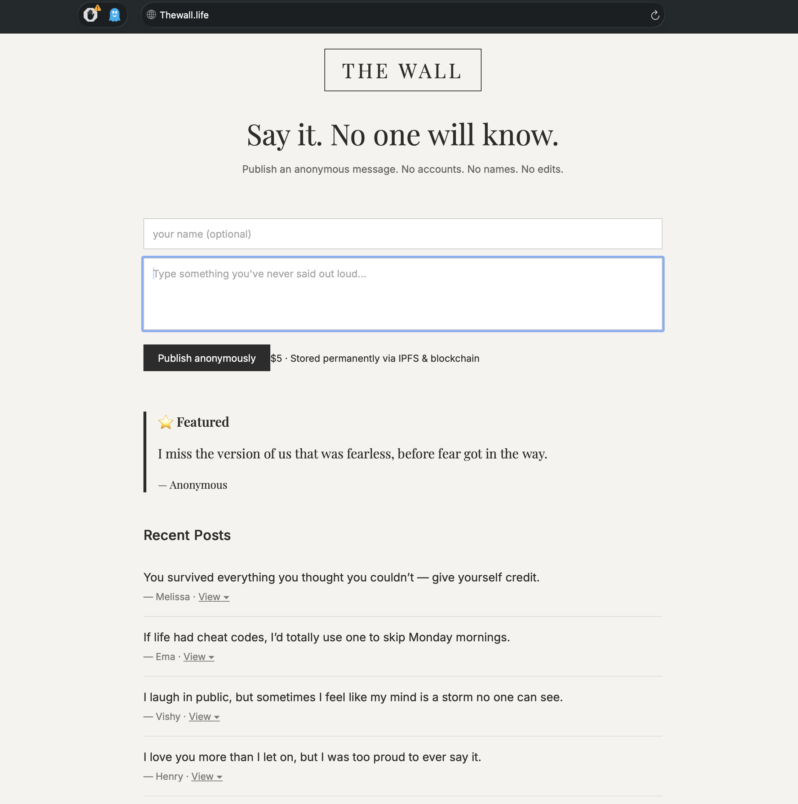

# thewall.life

**thewall.life** is a lightweight, containerized message wall application built with a DevOps-first mindset.  
The application itself is intentionally simple, while the focus is on clean architecture, containerization, and CI/CD automation.

---

## Features

- Post anonymous or named messages
- Featured message + recent posts
- REST API backend
- Stateless frontend served via Nginx
- Health checks for service monitoring
- Dockerized frontend and backend
- Jenkins-based CI/CD pipeline

---

## Tech Stack

**Application**
- Frontend: React (Nginx)
- Backend: FastAPI (Python)
- Database: SQLite (development & small-scale production)

**DevOps / Infrastructure**
- Docker & Docker Compose
- Jenkins (Pipeline as Code)
- GitHub
- Nginx
- Health checks & environment-based config

---

## Architecture

Browser
↓
Nginx (Frontend)
↓
FastAPI Backend
↓
SQLite Database


- Frontend communicates with backend via REST
- Backend exposes `/health` endpoint
- Services are isolated and networked via Docker Compose

---

## Repository Structure

thewall.life/
├── frontend/
├── backend/
├── docker-compose.yml
├── Jenkinsfile
└── README.md


---

## Local Setup

### Prerequisites
- Docker
- Docker Compose
- Git

### Run locally

```bash
docker compose up --build

```
- Frontend: http://localhost:3000

- Backend: http://localhost:8000

- Health check: http://localhost:8000/health

---

## 🚀 Live Preview (Local)

Frontend UI screenshot:



---

### CI/CD (Jenkins)

The project uses Jenkins Pipeline as Code.

Pipeline flow:

1. GitHub checkout

2. Docker image build

3. Deployment using Docker Compose

A push to the main branch triggers an automated redeploy.

---

### Configuration

Environment variables:

Variable	Purpose
REACT_APP_API_URL	Backend API URL
DATABASE_URL	Database connection string

Configured via Docker Compose and Jenkins.

---

### Health & Stability

- Backend health endpoint: /health

- Docker health checks ensure proper startup order

- Nginx used for frontend stability and performance

---

### Production Notes

- SQLite is sufficient for low traffic and demos

- Architecture supports easy migration to PostgreSQL

- Easily extensible with HTTPS, reverse proxy, or Kubernetes

---

### Author Notes

This project demonstrates real-world DevOps practices:

- Clear service separation

- Repeatable deployments

- Infrastructure as code

- Minimal manual intervention

Simple application. Solid execution.


---
